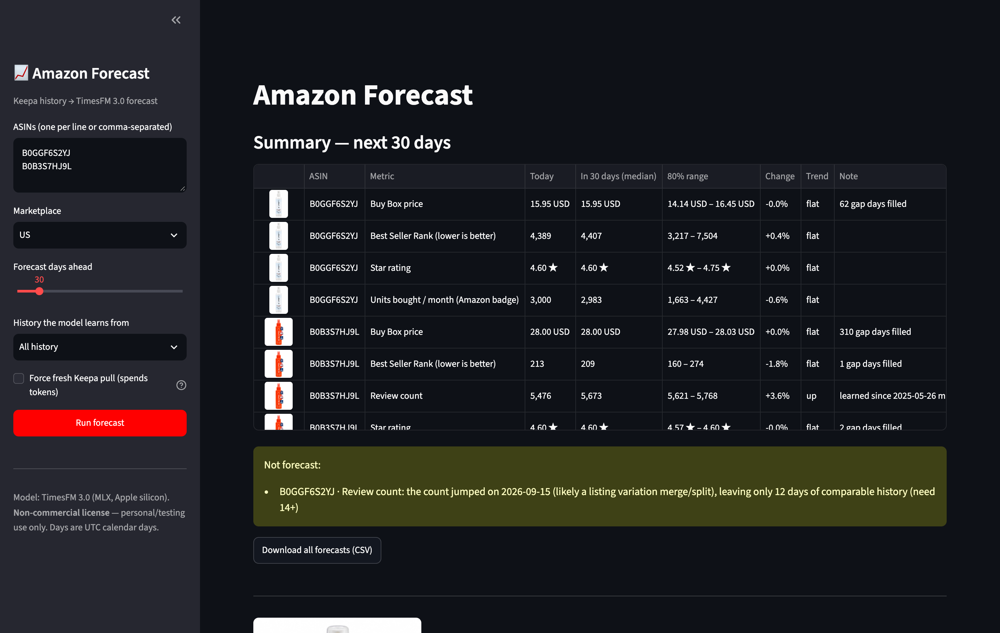
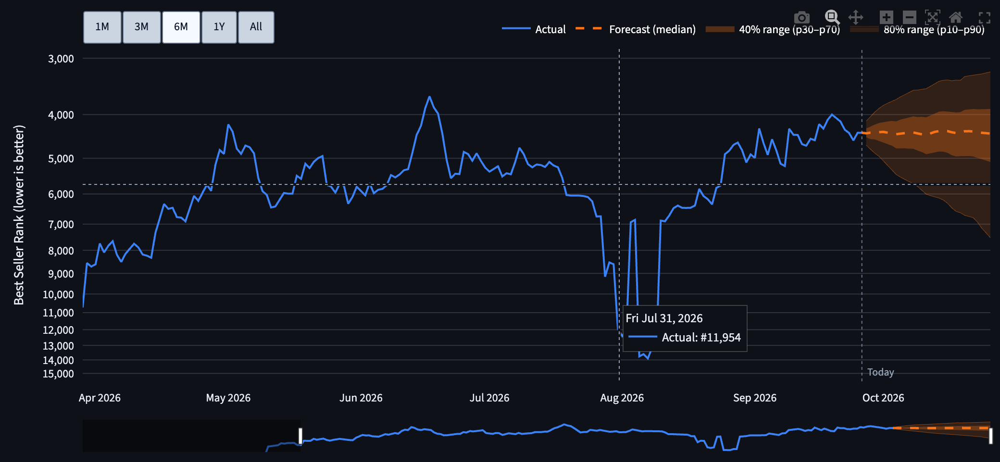
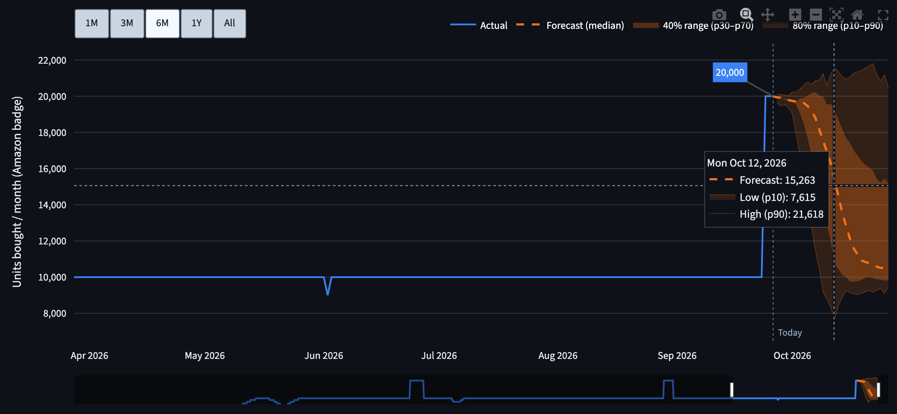
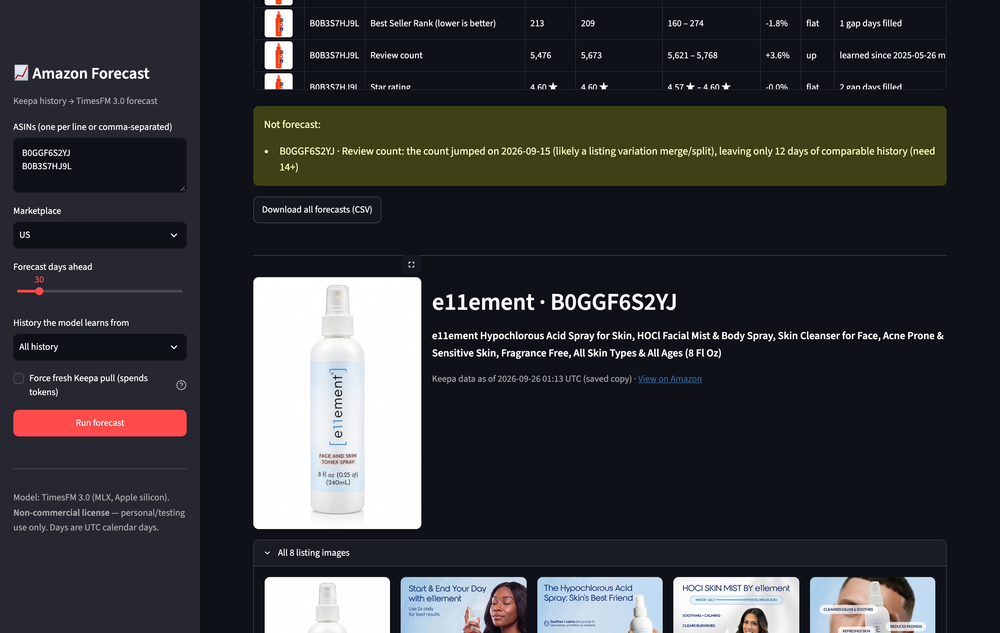

<div align="center">

# 📈 Amazon Forecast

### Predict where any Amazon listing is heading: sales rank, demand, price, reviews and rating

Type in an ASIN. Amazon Forecast pulls the listing's full daily history from **Keepa**,
cleans it, and forecasts the next 7–180 days with Google's **TimesFM 3.0** time-series
foundation model. You get stock-chart style graphs with confidence bands, a summary table and a CSV.




</div>

---

## Contents

- [What it does](#what-it-does)
- [Screenshots](#screenshots)
- [Requirements](#requirements)
- [Install](#install)
- [How to use it](#how-to-use-it)
- [Reading the charts](#reading-the-charts)
- [What gets forecast](#what-gets-forecast)
- [How the data is cleaned](#how-the-data-is-cleaned)
- [How accurate is it?](#how-accurate-is-it)
- [Keepa tokens and caching](#keepa-tokens-and-caching)
- [Troubleshooting](#troubleshooting)
- [Project structure](#project-structure)
- [License and important notices](#license-and-important-notices)

---

## What it does

| | |
|---|---|
| **Any ASIN, any marketplace** | US, CA, UK, DE, FR, IT, ES, JP, MX, IN, BR. Compare your listing against competitors side by side. |
| **Full history** | Pulls the complete Keepa history, often years of daily data, so the model can see seasonality. |
| **5 forecasts per product** | Units bought per month, Best Seller Rank, Buy Box price, review count and star rating. |
| **Honest uncertainty** | Every forecast has a median plus 40% and 80% ranges. It doesn't give you a single "magic number". |
| **Stock-chart graphs** | Hover to see the exact date and value, zoom buttons (1M / 3M / 6M / 1Y / All), drag-to-zoom and a range slider. |
| **Smart data cleaning** | Handles out-of-stock gaps, listing variation merges and splits, and one-day Keepa glitches automatically. |
| **Product images** | Main image, full listing gallery and a direct link to the Amazon page. |
| **Saves Keepa tokens** | Each pull is cached for 24 hours, so re-running and re-zooming is free. |
| **Runs locally** | Everything runs on your Mac. Your API key and data never leave your machine except for the Keepa request. |

---

## Screenshots

**Hover any point to see exact numbers.** This is sales rank on a log scale, where a better rank sits higher:



**Hover the forecast** to see the median plus the low (p10) and high (p90) range:



**Product images and listing details:**



---

## Requirements

| You need | Why |
|---|---|
| **Mac with Apple silicon** (M1 / M2 / M3 / M4) | TimesFM runs on Apple's MLX engine, which is fast and needs no GPU setup. |
| **Python 3.10 or newer** | 3.12 recommended. |
| **8 GB+ RAM** | The model uses about 1.5 GB. |
| **~2 GB free disk** | The model weights download once (about 1.3 GB) from Hugging Face. |
| **A [Keepa](https://keepa.com) API subscription** | The source of the price, rank, review and sales history. |

> Windows, Linux or Intel Mac? The app would need TimesFM's PyTorch backend instead of MLX.
> That's a small change in `forecast_app/forecasting.py`, but it isn't included or tested here.

---

## Install

**1. Clone the project**

```bash
git clone https://github.com/onlypromarketer/Amazon-Forecast.git
cd Amazon-Forecast
```

**2. Create a Python environment and install**

With [uv](https://docs.astral.sh/uv/) (fast):

```bash
uv venv --python 3.12 .venv
uv pip install --python .venv/bin/python -r requirements.txt
```

Or with plain pip:

```bash
python3 -m venv .venv
.venv/bin/pip install -r requirements.txt
```

**3. Add your Keepa API key**

```bash
cp .env.example .env
open -e .env        # paste your key after KEEPA_API_KEY=  and save
```

Find your key at **keepa.com → Account → API access**.
`.env` is in `.gitignore`, so your key is never committed.

**4. Start the app**

```bash
./run.sh
```

Then open **http://localhost:8502** in your browser.

The first forecast takes about 30 seconds because it downloads and loads the model. After that it takes a few seconds.

---

## How to use it

1. **Enter ASINs** in the sidebar, one per line or comma-separated. Mix your own products with competitors'.
2. **Pick the marketplace** (US, CA, UK…).
3. **Forecast days ahead:** 7 to 180 days.
4. **History the model learns from:** *All history* is the default and works best. Choose a shorter window
   if a product changed a lot recently, for example after a relaunch or a new listing.
5. Press **Run forecast**.

You get:

- **Summary table:** today's value, the forecast at the end of the period, the 80% range, % change and trend
  for every product and metric, with notes about anything unusual in the data.
- **A section per product:** image, title, link to Amazon, the listing gallery, and one chart tab per metric.
- **Download all forecasts (CSV):** day-by-day median and p10…p90 for every metric, ready for Sheets or Excel.

---

## Reading the charts

| On the chart | Meaning |
|---|---|
| **Blue line** | What actually happened (Keepa history) |
| **Orange dashed line** | The forecast median, the single most likely path |
| **Dark orange band** | 40% range (p30–p70): the likely zone |
| **Light orange band** | 80% range (p10–p90): 8 times out of 10, reality should land in here |
| **Blue tag** | Latest actual value |
| **Dotted "Today" line** | Where history ends and the forecast begins |

**Controls**

- **Hover:** crosshair with the exact date and number
- **1M · 3M · 6M · 1Y · All:** jump to a time window (the vertical axis rescales automatically)
- **Click and drag:** zoom into any period
- **Double-click:** reset the view
- **Slider under the chart:** scroll through the full history

**A wide band means the model is unsure.** Treat those forecasts as a range, not a number.

---

## What gets forecast

| Metric | Keepa source | Notes |
|---|---|---|
| **Units bought / month** | `monthlySoldHistory` | Amazon's public "X+ bought in past month" badge. It comes in **buckets** (50+, 100+, 1K+…), so it's a rough demand signal, **not exact unit sales**. |
| **Best Seller Rank** | `csv[3]` sales rank | Main category. Forecast in log space, because rank moves in multiples. Lower is better. |
| **Buy Box price** | `csv[18]` (+ shipping) | Falls back to the lowest New price if there is no Buy Box history. Currency is labelled. |
| **Review count** | `csv[17]` | Reviews + ratings count. Protected against variation merges (see below). |
| **Star rating** | `csv[16]` | Clipped to 1–5 ★. |

> Want **real unit sales**? Keepa doesn't have them. A natural next step is adding a Seller Central
> Business Report import for your own ASINs.

---

## How the data is cleaned

Keepa data has quirks that produce confidently wrong forecasts if they're ignored.
All of these are handled and covered by tests:

| Problem | What the app does |
|---|---|
| Keepa stores time as "minutes since 2011" and prices in cents | Converts to real dates (UTC days) and dollars |
| `-1` means out of stock / no Buy Box / no rank | Treated as a gap, not as a price of -$0.01 |
| Keepa only logs *changes* | Rebuilt into one value per day (a value holds until it changes) |
| Out-of-stock gaps | Filled with the last known value for the model, and the number of filled days is shown |
| **Listing variation merge / split** (reviews jump 2,782 → 39 → 2,855) | Detected. The model learns only from data after the last jump. If there's too little, the metric isn't forecast and the app says why. |
| **One-day Keepa glitches** (5,028 → 2,452 → 5,080) | Ignored instead of being treated as a merge |
| Too little or mostly missing history | Not forecast, with a clear reason. The minimum is 14 days, with no more than 50% missing. |
| A badge or rating that *just* changed | Flagged "low confidence", because the model has barely seen the new level |

---

## How accurate is it?

We checked it the honest way: **hide the last 30 days of real Keepa history, forecast them,
and compare against what actually happened.** The results were also compared with the simplest
possible baseline, "tomorrow looks like today".

Results on two real listings (12 test windows over the past year):

| Listing / metric | Typical error | Notes |
|---|---|---|
| Established listing (4 yrs), **review count** | **0.2–3.7%** | Clearly beats the baseline |
| Established listing, **sales rank** | **~11%** with all history (vs ~17% with 1 year) | Full history helps. It caught a big swing the baseline missed (36% vs 165% error). |
| Established listing, price / rating | ~0% | Stable listing, easy to forecast |
| New listing (8 months), **sales rank** | 10–33% | Often **no better than the baseline**. Young, jumpy listings are hard to predict, so rely on the ranges. |

**Bottom line:** it's strongest on established listings and on steady metrics like reviews.
For young listings, use the **range**, not the single number.
Real-life accuracy on your products will vary.

---

## Keepa tokens and caching

- Each product pull costs Keepa tokens (history + Buy Box + rating data).
- Every pull is saved to `cache/<marketplace>_<ASIN>.json` and **reused for 24 hours**.
  Changing the horizon, history window or zoom is free.
- Tick **Force fresh Keepa pull** to refresh now (this spends tokens).
- Your remaining token balance is shown after each fresh pull.
- The `cache/` folder is in `.gitignore`.

---

## Troubleshooting

| Problem | Fix |
|---|---|
| `KEEPA_API_KEY is not set` | Create `.env` from `.env.example`, paste your key, restart `./run.sh` |
| `Keepa request failed` | Check the key is correct and your Keepa account has tokens left |
| "Keepa has no product for this ASIN" | Check the ASIN and the marketplace (a US ASIN won't exist in DE, for example) |
| "Not forecast: only N days of history" | The listing is too new, or had a recent variation merge. Try again later. |
| First run is slow | Normal. The model downloads (~1.3 GB, once) and loads (~30 s) |
| `ModuleNotFoundError: mlx` / MLX errors | Needs an Apple-silicon Mac (see [Requirements](#requirements)) |
| Port 8502 already in use | `./run.sh --server.port 8503` |

---

## Project structure

```
Amazon-Forecast/
├── app.py                     # Streamlit dashboard (charts, table, images, CSV)
├── run.sh                     # Start the app on http://localhost:8502
├── requirements.txt           # TimesFM (pinned), Keepa, Streamlit, pandas, Plotly
├── .env.example               # Template for your Keepa API key
├── .streamlit/config.toml     # Hides Streamlit's deploy button
├── forecast_app/
│   ├── keepa_source.py        # Keepa fetch + 24h local cache
│   ├── series.py              # Keepa decoding, daily series, gap/merge/glitch handling, images
│   └── forecasting.py         # TimesFM 3.0 batch forecasting + summaries
├── tests/                     # 63 tests: decoding, cleaning, caching, forecasting
└── docs/screenshots/
```

Run the tests:

```bash
.venv/bin/python -m pytest -q tests
```

---

## License and important notices

- **This project's code** is released under the [MIT License](LICENSE).
- **TimesFM 3.0 model weights** (`google/timesfm-3.0-pytorch`) are published by Google under the
  `timesfm-non-commercial-license-v1.0` and are **restricted to non-commercial, non-production use**.
  Using this app with those weights for paid client work or in production is **not permitted** by that license.
  For commercial use, switch to **TimesFM 2.5** (Apache-2.0). See the
  [TimesFM repository](https://github.com/google-research/timesfm) for details.
- **Keepa data** is subject to [Keepa's terms of service](https://keepa.com/#!terms). Bring your own API key.
- Not affiliated with, endorsed by, or sponsored by Amazon, Google or Keepa.
  Product names, images and trademarks belong to their owners.
- Forecasts are statistical estimates, not guarantees. Don't make inventory or spending decisions
  on a forecast alone.

---

<div align="center">

Built by **[Pro Marketer](https://promarketer.ca)**

</div>
